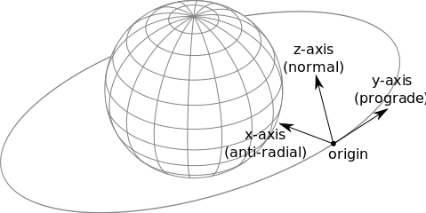
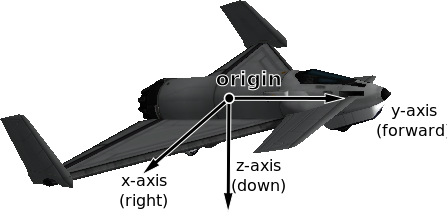

###2.2 参考系

+ 2.2.1 Introduction简介
	- Origin Position and Axis Orientation原点位置和轴方向
		* Celestial Body Reference Frame天体参考系
		* Vessel Orbital Reference Frame飞行器轨道参考系
		* Vessel Surface Reference Frame飞行器表面参考系
	- Linear Velocity and Angular Velocity线速度和角速度
+ 2.2.2 Available Reference Frames可用的参考系
+ 2.2.3 Converting Between Reference Frames参考系转换
+ 2.2.4 Visual Debugging可视化调试
+ 2.2.5 Examples实例
	- Navball directions 导航球方向
	- Orbital directions轨道方向
	- Surface ‘prograde地表接近？
	- Orbital speed轨道速度
	- Surface speed表面速度
	- Angle of attack攻角

####2.2.1 简介
All of the positions, directions, velocities and rotations in kRPC are relative to something, and reference frames define what that something is.  
kRPC里所有位置、方向、速度和旋转都和某种东西相联系，而这个东西就是参考系。


参考系规定：

+ 原点的位置在`（0,0,0）`，
+ 坐标轴的方向`x`，`y`和`z`，
+ 原点的线性速度（如果参考系移动）
+ 坐标轴的角速度（坐标轴旋转的速度和方向）

<table><tr><td bgcolor=#CCFFFF>
注意: KSP和kRPC 都使用左手参考系
</td></tr></table>

####原点位置和坐标轴方向
下面给出了一些各种参考系的原点位置和坐标轴方向的例子。

######天体参考系
参考系通过调用`CelestialBody.reference_frame`获得Kerbin所具有的以下特性：

+ 在Kerbin中心的原点，
+ 从Kerbin中心指向北极点的Y轴，
+ 从Kerbin中心指向本初子午线与赤道交点的X轴（行星表面的位置在经度0°，纬度0°），
+ 从Kerbin中心指向东经90°与赤道交点的Z轴，
+ and the axes rotate with the planet, i.e. the reference frame has the same rotational/angular velocity as Kerbin.  
坐标轴随行星旋转，即参考系具有与Kerbin相同的转速/角速度。

  
_一个天体参考系，例如Kerbin。<br>蓝色表示赤道，红色表示本初子午线。<br>黑色箭头表示坐标轴，原点位于星球中心。_

This means that the reference frame is fixed relative to Kerbin – it moves with the center of the planet, and also rotates with the planet. Therefore, positions in this reference frame are relative to the center of the planet. The following code prints out the position of the active vessel in Kerbin’s reference frame:  
这意味着参考系与Kerbin相对固定——它随着行星中心移动同时也随行星转动。因此，在参考系中的位置是相对于行星中心的。下面的代码会打印出在Kerbin的参考系中被激活飞行器的位置：
```python3

import krpc
conn = krpc.connect()
vessel = conn.space_center.active_vessel
print(vessel.position(vessel.orbit.body.reference_frame))

```

对于一个坐落在发射台的飞行器，它的位置矢量大约是600000米（等于Kerbin半径）。位置矢量不随时间变化，因为坐落在Kerbin表面的飞行器和参考系也都随着Kerbin转动。

######飞行器轨道参考系
Another example is the orbital reference frame for a vessel, obtained by calling `Vessel.orbital_reference_frame`. This is fixed to the vessel (the origin moves with the vessel) and is orientated so that the axes point in the orbital prograde/normal/radial directions.  
另一个例子是一个飞行器的轨道参考系，通过调用`Vessel.orbital_reference_frame`获得。它与飞行器绑定（原点随飞行器运动）并且坐标轴的指向分别为轨道的前进方向/法线/径向。

+ 原心是飞行器的质心，
+ Y轴指向飞行器轨道前进方向，
+ X轴指向与飞行器轨道径向相反的方向，
+ Z轴指向飞行器轨道的法线方向，
+ and the axes rotate to match any changes to the prograde/normal/radial directions, for example when the prograde direction changes as the vessel continues on its orbit.  
坐标轴随着前进方向/法线/径向的任何变化而变化，例如当前进方向随飞行器沿轨道前进而变化时。

  
_飞行器的轨道参考系。_

######飞行器表面参考系
Another example is Vessel.reference_frame. As with the previous example, it is fixed to the vessel (the origin moves with the vessel), however the orientation of the coordinate axes is different. They track the orientation of the vessel:  
`Vessel.reference_frame`的另一个例子。和前一个例子一样，它是与飞行器绑定的（原点随飞行器运动），但是坐标轴的方向是不同的。它们监测飞行器的方向：

+ 原点在飞行器的质心
+ Y轴方向与飞行器的指向相同
+ X轴指向飞行器的右侧
+ Z轴指向飞行器的下方
+ 坐标轴随飞行器位置的任何变化而变化

  
_一个飞行器的参考系。_

####线速度和角速度

Reference frames move and rotate relative to one another. For example, the reference frames discussed previously all have their origin position fixed to some object (such as a vessel or a planet). This means that they move and rotate to track the object, and so have a linear and angular velocity associated with them.  
参考系相对于另一个物体移动和旋转。例如前面讨论的参考系的原点固定在某些对象（如飞行器或行星）上，这意味着它们跟随这些对象移动或转动，所以它们也获得了线速度与角速度。

For example, the reference frame obtained by calling CelestialBody.reference_frame for Kerbin is fixed relative to Kerbin. This means the angular velocity of the reference frame is identical to Kerbin’s angular velocity, and the linear velocity of the reference frame matches the current orbital velocity of Kerbin.
例如，通过`CelestialBody.reference_frame`调用绑定在Kerbin上的参考系，这意味着这参考系的角速度与Kerbin的角速度相等，并且该参考系的线速度也与Kerbin当前的轨道速度一致。

###2.2.2 可用的参考系
kRPC提供以下参考系：

+ `Vessel.reference_frame`
+ `Vessel.orbital_reference_frame`
+ `Vessel.surface_reference_frame`
+ `Vessel.surface_velocity_reference_frame`
+ `CelestialBody.reference_frame`
+ `CelestialBody.non_rotating_reference_frame`
+ `CelestialBody.orbital_reference_frame`
+ `Node.reference_frame`
+ `Node.orbital_reference_frame`
+ `Part.reference_frame`
+ `DockingPort.reference_frame`

###2.2.3 参考系转换
kRPC provides utility methods to convert positions, directions, rotations and velocities between the different reference frames:  
kRPC提供了一组方法用于在不同参考系之间转换位置、方向、旋转和速度： 

+ `SpaceCenter.transform_position()`
+ `SpaceCenter.transform_direction()`
+ `SpaceCenter.transform_rotation()`
+ `SpaceCenter.transform_velocity()`

###2.2.4 可视化调试
References frames can be confusing, and choosing the correct one is a challenge in itself. To aid debugging, kRPC provides some methods with which you can draw direction vectors in-game.  
参考系容易让人困惑，选择适当的参考系本身就是一个挑战，kRPC提供一些可以让你在游戏中绘制方向向量的方法来帮助调试。


`SpaceCenter.draw_direction()` will draw a direction vector, starting from the center of mass of the active vessel. For example, the following code draws the direction of the current vessels velocity relative to the surface:  
`SpaceCenter.draw_direction() `会以被激活飞行器的质心为起点绘制一个方向向量。例如，下面的代码绘制了当前飞行器相对于地表的速度方向：
```python3

import krpc
conn = krpc.connect(name='Visual Debugging')
vessel = conn.space_center.active_vessel

ref_frame = vessel.orbit.body.reference_frame
velocity = vessel.flight(ref_frame).velocity
conn.space_center.draw_direction(velocity, ref_frame, (1,0,0))

while True:
   pass

```
<table><tr><td bgcolor=#CCFFFF>
注意: 客户端必须保持连接，否则kRPC将停止绘制方向，因此在这个例子中以一个while循环结尾。 
</td></tr></table>

###2.2.5 实例
下面的例子演示了参考系的多种用法。 

####导航球方向
This example demonstrates how to make the vessel point in various directions on the navball:
这个例子演示了如何让飞行器朝向导航球上的多个方向：
```python3

import krpc
conn = krpc.connect(name='Navball directions')
vessel = conn.space_center.active_vessel
ap = vessel.auto_pilot
ap.reference_frame = vessel.surface_reference_frame
ap.engage()

# Point the vessel north on the navball, with a pitch of 0 degrees
ap.target_direction = (0,1,0)
ap.wait()

# Point the vessel vertically upwards on the navball
ap.target_direction = (1,0,0)
ap.wait()

# Point the vessel west (heading of 270 degrees), with a pitch of 0 degrees
ap.target_direction = (0,0,-1)
ap.wait()

ap.disengage()

```

该代码使用了飞行器的表面参考系（`Vessel.surface_reference_frame`），如下图所示： 

  


Line 9 instructs the auto-pilot to point in direction` (0,1,0) `(i.e. along the y-axis) in the vessel’s surface reference frame. The y-axis of the reference frame points in the north direction, as required.    
第9行指示自动驾驶仪指向飞行器的表面参考系中的`（0,1,0）`（即沿Y轴方向），Y轴指向北方。

Line 13 instructs the auto-pilot to point in direction `(1,0,0)` (along the x-axis) in the vessel’s surface reference frame. This x-axis of the reference frame points upwards (away from the planet) as required.  
第13行指示自动驾驶仪指向飞行器的表面参考系中的`（1,0,0）`（沿X轴方向），X轴方向向上（远离行星）。

Line 17 instructs the auto-pilot to point in direction `(0,0,-1) `(along the negative z axis). The z-axis of the reference frame points east, so the requested direction points west – as required.  
第17行指示自动驾驶仪指向飞行器的表面参考系中的`（0,0,-1）`（沿Z轴负方向），由于参考系的Z轴指向东方，所以需要将方向指向西方。 

####轨道方向
This example demonstrates how to make the vessel point in the various orbital directions, as seen on the navball when it is in ‘orbit’ mode. It uses `Vessel.orbital_reference_frame`.  
这个例子演示了如何让飞行器朝向多个不同的轨道方向，就像在导航球“orbit（轨道）”模式中看到的一样，它使用了`Vessel.orbital_reference_frame`。
```python3

import krpc
conn = krpc.connect(name='Orbital directions')
vessel = conn.space_center.active_vessel
ap = vessel.auto_pilot
ap.reference_frame = vessel.orbital_reference_frame
ap.engage()

# Point the vessel in the prograde direction
ap.target_direction = (0,1,0)
ap.wait()

# Point the vessel in the orbit normal direction
ap.target_direction = (0,0,1)
ap.wait()

# Point the vessel in the orbit radial direction
ap.target_direction = (-1,0,0)
ap.wait()

ap.disengage()

```

该段代码使用了飞行器的轨道参考系，如下图：

 

####Surface ‘prograde’ 地表接近？
This example demonstrates how to point the vessel in the ‘prograde’ direction on the navball, when in ‘surface’ mode. This is the direction of the vessels velocity relative to the surface:  
这个例子演示了如何在“Surface”模式时让飞行器朝向导航球的“prograde”方向。这是飞行器相对于地表的速度方向：
```python3

import krpc
conn = krpc.connect(name='Surface prograde')
vessel = conn.space_center.active_vessel
ap = vessel.auto_pilot

ap.reference_frame = vessel.surface_velocity_reference_frame
ap.target_direction = (0,1,0)
ap.engage()
ap.wait()
ap.disengage()

```

该代码使用了`Vessel.surface_velocity_reference_frame`，如下图： 

 

#### 轨道速度
To compute the orbital speed of a vessel, you need to get the velocity relative to the planet’s non-rotating reference frame (`CelestialBody.non_rotating_reference_frame`). This reference frame is fixed relative to the body, but does not rotate:  
要计算飞行器的轨道速度，你需要获取与行星的非旋转参考系相对应的速度（`CelestialBody.non_rotating_reference_frame`）。这个参考系与实体绑定，但不旋转：
```python3

import krpc, time
conn = krpc.connect(name='Orbital speed')
vessel = conn.space_center.active_vessel

while True:

    velocity = vessel.flight(vessel.orbit.body.non_rotating_reference_frame).velocity
    print('Orbital velocity = (%.1f, %.1f, %.1f)' % velocity)

    speed = vessel.flight(vessel.orbit.body.non_rotating_reference_frame).speed
    print('Orbital speed = %.1f m/s' % speed)

    time.sleep(1)

```

#### 表面速度
To compute the speed of a vessel relative to the surface of a planet/moon, you need to get the velocity relative to the planets reference frame (`CelestialBody.reference_frame`). This reference frame rotates with the body, therefore the rotational velocity of the body is taken into account when computing the velocity of the vessel:  
要计算一个飞行器相对于行星/卫星的表面速度，你需要获取与行星参考系相对应的速度（`CelestialBody.reference_frame`），该参考系随实体旋转，因此在计算飞行器相对于地表的表面速度时，实体的转速也被考虑在内。
```python3

import krpc, time
conn = krpc.connect(name='Surface speed')
vessel = conn.space_center.active_vessel

while True:

    velocity = vessel.flight(vessel.orbit.body.reference_frame).velocity
    print('Surface velocity = (%.1f, %.1f, %.1f)' % velocity)

    speed = vessel.flight(vessel.orbit.body.reference_frame).speed
    print('Surface speed = %.1f m/s' % speed)

    time.sleep(1)

```

#### 攻角
This example computes the angle between the direction the vessel is pointing in, and the direction that the vessel is moving in (relative to the surface):  
这个例子计算了飞行器朝向与行进方向的夹角（相对于地表）：
```python3

import krpc, math, time
conn = krpc.connect(name='Angle of attack')
vessel = conn.space_center.active_vessel

while True:

    d = vessel.direction(vessel.orbit.body.reference_frame)
    v = vessel.velocity(vessel.orbit.body.reference_frame)

    # Compute the dot product of d and v
    dotprod = d[0]*v[0] + d[1]*v[1] + d[2]*v[2]

    # Compute the magnitude of v
    vmag = math.sqrt(v[0]**2 + v[1]**2 + v[2]**2)
    # Note: don't need to magnitude of d as it is a unit vector

    # Compute the angle between the vectors
    if dotprod == 0:
        angle = 0
    else:
        angle = abs(math.acos (dotprod / vmag) * (180. / math.pi))

    print('Angle of attack = %.1f' % angle)

    time.sleep(1)

```
Note that the orientation of the reference frame used to get the direction and velocity vectors (on lines 7 and 8) does not matter, as the angle between two vectors is the same regardless of the orientation of the axes. However, if we were to use a reference frame that moves with the vessel, line 8 would return `(0,0,0)`. We therefore need a reference frame that is not fixed relative to the vessel. `CelestialBody.reference_frame` fits these requirements.  
请注意，用来得到方向和速度矢量（第7行和第8行）的参考系的方向无所谓，无论坐标轴的方向如何，两个矢量之间的角度是一样的。但是假如我们使用了一个随飞行器移动的参考系，第8行将会返回`(0,0,0)`。因此我们需要一个不与飞行器绑定的参考系。`CelestialBody.reference_frame`就符合这些要求。