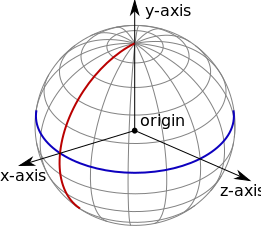
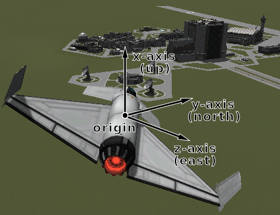

#kRPC V0.2.2 中文文档 

原始出处:<http://krpc.github.io/krpc/index.html>
本项目地址:<https://github.com/gc313/krpc_cn>


kRPC允许你通过游戏外运行的脚本操作坎巴拉太空计划（Kerbal Space Program）。它自带了许多可为流行语言使用的客户端库，包括C++、C #，java，Lua和Python。


+ 入门指南
+ 教程和实例
+ 客户端、服务器和其他的工具

The mod exposes most of KSPs API and includes support for Kerbal Alarm Clock and Infernal Robotics. This functionality is provided to client programs via a Remote Procedure Call server, using protocol buffers for serialization. The server component sets up a TCP/IP server that remote scripts can connect to. This communication could be on the local machine only, over a local network, or even over the wider internet if configured correctly. The server is also extensible. Additional remote procedures (grouped into “services”) can be added to the server using the “Service API”.

该MOD公开调用大部分KSPs API接口并包含了对Kerbal Alarm Clock和Infernal Robotics的支持。该功能通过使用Protocol Buffers将结构数据序列化来远程调用服务器。服务器组件设置了一个远程脚本可以连接的TCP/IP服务器。这种通信可以只在本地机器进行，也可以在局域网中，如果进行正确的配置甚至可以在互联网中进行通信。服务器也可以拓展。额外的远程程序（分组为“services”）可以用“Service API”添加到服务器。


###目录

+ [开始]

    - [服务器插件]
    - [Python客户端]
    - [“Hello World”脚本] 
    - [更进一步...]

+ [教程和实例]

    - [亚轨道飞行]
    - [参考系]
    - [发射入轨]
    - [俯仰、航向和滚动]
    - [零件交互控制]
    - [对接指南]

+ C#

    - C# Client
    - SpaceCenter API
    - InfernalRobotics API
    - Kerbal Alarm Clock API

+ C++

    - C++ Client
    - SpaceCenter API
    - InfernalRobotics API
    - Kerbal Alarm Clock API

+ Java
    - Java Client
    - SpaceCenter API
    - InfernalRobotics API
    - Kerbal Alarm Clock API

+ Lua
    - Lua Client
    - SpaceCenter API
    - InfernalRobotics API
    - Kerbal Alarm Clock API

+ Python
    - Python Client
    - SpaceCenter API
    - InfernalRobotics API
    - Kerbal Alarm Clock API

+ Other Clients, Services and Scripts
    - Clients

+ Compiling kRPC
    - Install Dependencies
    - Setup your Environment
    - Building using Bazel
    - Building the C# projects using an IDE

+ Extending kRPC
    - The kRPC Architecture
    - Service API
    - Documentation
    - Further Examples
    - Generating Service Code for Static Clients
    
+ Communication Protocol
    - Establishing a Connection
    - Remote Procedures
    - Protocol Buffer Encoding
    - Streams
    - KRPC Service
    - Service Description Message

+ Internals of kRPC
    - Server Performance Settings


##第一章 开始
 
这个简短的指南介绍kRPC的获取、设置和运行的基础知识，并通过一个基础的Python脚本演示与游戏的通信。
###1.1 服务器插件
####1.1.1 安装
1. 从这些地方下载kRPC服务器插件：  
    + Github  
    + SpaceDock  
    + Curse  
    + 或通过CKAN获得插件  
2. 提取gamedata文件夹到您的KSP目录。  
3. 启动KSP和加载保存游戏。  
4. 服务器窗口应该在向你打招呼了： 


5. 点击 “Start server” 启动服务器！如果一切顺利的话，灯应该变成快乐的绿色： 


6. 你可以通过点击在右上角的关闭按钮或kRPC图标隐藏或显示窗口： 

  

这个图标也会在服务器在线时变为绿色。
####1.1.2 配置
服务器可以通过显示在游戏中的窗口配置，配置选项是：

1. Address（地址）：这是服务器将侦听的地址。只允许本地机器连接，选择“localhost”（默认值）。要允许网络上的连接，可以选择您的本机IP地址，或选择“Mannual”（手动），手动输入本机IP地址。  
2. RPC和Stream的端口号：这些必须设置为你的机器上可用的端口号，大多数情况可以使用默认设置。

也有一些高级设置，默认情况下被隐藏，可以通过勾选“Advanced settings”复选框显示：

1. Auto-start server（自动启动服务器）：启用时，服务器在游戏载入时将自动启动。
2. Auto-accept new clients（自动接受新的客户端）：启用时，新的客户端连接是自动允许的。当禁用时，新的客户端请求连接时会弹出询问。

其他服务器属性的高级设置。详情见[这里](http://krpc.github.io/krpc/internals.html#server-performance-settings)。

###1.2 Python客户端

<table><tr><td bgcolor=#CCFFFF>
注意: kRPC 支持 Python 2.7 和 Python 3.x. <p> 
（译者注：下面的脚本都是用的Python3.x）
</td></tr></table>
####1.2.1 在Windows系统中
1. 如果你还没有安装Python，下载Python安装程序并运行它：<https://www.python.org/downloads/windows> ，运行安装程序时，确保pip已安装妥当。
2. 安装krpc Python模块，打开命令提示符并运行以下命令：`C:\Python27\Scripts\pip.exe install krpc`你可能需要更改`C:\Python27`为你的Python实际安装位置。  
3. 运行Python IDLE（或你喜欢的编辑器）开始编程！

####1.2.2 在Linux系统中

1. 你的Linux系统可能已经自带了Python。如果没有，使用你喜欢的软件包管理器安装它，或者从这里下载<https://www.python.org/downloads>
2. 你还需要安装pip，可以使用你的软件包管理器安装，或从这里得到它<https://pypi.python.org/pypi/pip>
3. 通过从终端运行以下命令安装kRPC Python模块：`sudo pip install krpc`
4. 开始编码！ 

###1.3 “Hello World”脚本
运行KSP并使用默认设置启动服务器。然后运行下面的Python脚本：
```python3

import krpc
conn = krpc.connect(name='Hello World')
vessel = conn.space_center.active_vessel
print(vessel.name)

```
它们做了这些事：第1行加载kRPCPython模块，第2行将打开一个新的连接到服务器，第3行获取激活的飞行器，第4行打印出飞行器的名字。你可以看到如下内容：  


祝贺你！你完成了你的第一个KSP脚本。

###1.4 更进一步...

+ kRPC一些更有趣的例子，你可以做一下[教程]。
+ 也提供一些其他语言的客户端，包括C++、C#、Java和Lua。
+ 也可以通过其他任何你喜欢的语言与服务器通信——只要它支持网络I/O。

##第二章 教程和实例
这个系列的教程和例子说明如何使用kRPC的特性。它们是为Python客户端写的，不过概念适用于所有的客户端语言。

+ 亚轨道飞行
+ 参考坐标系
+ 发射入轨
+ 俯仰、航向和滚动
+ 零件交互控制（Interacting with Parts）
+ 对接指南

###2.1 亚轨道飞行
这个入门教程使用kRPC送一些小绿人在亚轨道飞行，并安全返回（希望）到Kerbin。它涵盖了以下主题：

+ 控制火箭（激活阶段activating stages，设置节流阀）
+ 使用自动驾驶仪指引飞行器到特定方向
+ 监控飞行器的燃料量
+ 跟踪飞行轨道数据（如高度和远拱点高度）

<table><tr><td bgcolor=#CCFFFF>
注意: 有关如何编写脚本和连接kRPC，请看入门指南。
</td></tr></table>
####2.1.1 第一部分 发射准备
本教程使用的2级火箭图片如下。这种火箭的工艺文件可以在这里[下载](http://krpc.github.io/krpc/_downloads/SubOrbitalFlight.craft)，整个的Python脚本在[这里](http://krpc.github.io/krpc/_downloads/SubOrbitalFlight.py)。

  

我们需要做的第一件事是加载客户端模块，打开到服务器的连接。我们还可以为我们的脚本起一个描述性的名字，它将出现在游戏里的服务器窗口中：

```python3

import krpc
conn = krpc.connect(name='Sub-orbital flight script')

```
下一步，我们需要得到一个对象，表示被激活的飞行器。正是通过这个对象，我们将指令发送给火箭：

```python3

vessel = conn.space_center.active_vessel

```
然后我们需要进行发射火箭前的准备。随后的代码设置节流阀至最大并且指示自动驾驶仪保持俯仰和航向为90°（垂直向上）。然后等待1秒让这些设置生效。
```python3

vessel.auto_pilot.target_pitch_and_heading(90,90)
vessel.auto_pilot.engage()
vessel.control.throttle = 1
import time
time.sleep(1)

```
####2.1.2 第二部分 发射！
我们现在准备通过激活第一阶段来发射（相当于按空格键）：
```python3

print('Launch!')
vessel.control.activate_next_stage()

```
火箭固体燃料的阶段，将很快耗尽，需要抛弃。我们可以监测火箭固体燃料的量，使用一个循环，反复检查火箭还有多少固体燃料。当循环退出时，我们将启动下一阶段抛弃助推器：
```python3

while vessel.resources.amount('SolidFuel') > 0.1:
    time.sleep(1)
print('Booster separation')
vessel.control.activate_next_stage()

```
在这段代码，`vessel.resources`返回一个`Resources(资源)`对象来得到关于火箭的资源信息。

####2.1.3 第三部分 到达远拱点
下一步，当火箭达到足够高的高度我们将执行一个重力转向。下面的循环将反复检查火箭的高度，当高度达到10km时退出循环：
```python3

while vessel.flight().mean_altitude < 10000:
   time.sleep(1)

```
在这段代码，调用`vessel.flight()`返回一个`Flight`对象，用来获取各种关于火箭的信息，比如航向和速度。

Now we need to angle the rocket over to a pitch of 60° and maintain a heading of 90° (west). To do this, we simply reconfigure the auto-pilot:  
现在我们需要调整火箭的俯仰角度为60°，保持航向90°（西）。要做到这一点，我们只需要简单的重新配置自动驾驶仪：
```python3

print('Gravity turn')
vessel.auto_pilot.target_pitch_and_heading(60,90)

```
现在，我们等着远拱点达到100km，然后减小节流阀至零，抛弃发射段，关掉自动驾驶仪：
```python3

while vessel.orbit.apoapsis_altitude < 100000:
   time.sleep(1)
print('Launch stage separation')
vessel.control.throttle = 0
time.sleep(1)
vessel.control.activate_next_stage()
vessel.auto_pilot.disengage()

```
在这段代码中，`vessel.orbit`返回一个`Orbit(轨道)`对象，包含所有有关火箭轨道的信息。
####2.1.4 第四部分 安全返回Kerbin
Our Kerbals are now heading on a sub-orbital trajectory and are on a collision course with the surface. All that remains to do is wait until they fall to 1km altitude above the surface, and then deploy the parachutes. If you like, you can use time acceleration to skip ahead to just before this happens - the script will continue to work.  
我们的小绿人现在正处在一个与地面碰撞的亚轨道中。剩下要做的就是等到他们降落到距地面上方1km高度时打开降落伞。如果你喜欢，你可以在这个情况下使用时间加速跳过前面，脚本将继续工作。
```python3

while vessel.flight().surface_altitude > 1000:
    time.sleep(1)
vessel.control.activate_next_stage()

```
降落伞应该已经部署好了。下面的代码将反复打印出太空舱的高度，直到它的速度达到零——它着陆的时候：
```python3

while vessel.flight(vessel.orbit.body.reference_frame).vertical_speed < -0.1:
    print('Altitude = %.1f meters' % vessel.flight().surface_altitude)
    time.sleep(1)
print('Landed!')

```
This bit of code uses the `vessel.flight()` function, as before, but this time it is passed a `ReferenceFrame` parameter. We want to get the vertical speed of the capsule relative to the surface of Kerbin, so the values returned by the `flight` object need to be relative to the surface of Kerbin. We therefore pass `vessel.orbit.body.reference_frame` to `vessel.flight()` as this reference frame has its origin at the center of Kerbin and it rotates with the planet. For more information, check out the tutorial on Reference Frames.  
这段代码使用了和前面一样的`vessel.flight()`函数，但这次是通过`ReferenceFrame(参考系)`参数调用。我们想得到太空舱相对于Kerbin表面的垂直速度，所以`Flight`对象返回的值需要相对于Kerbin表面。因此我们通过以`vessel.orbit.body.reference_frame`为参数调用`vessel.flight()`获得一个以Kerbin地心为原点并随之转动的参考系。有关更多信息，查看[参考系]的教程。

你的小绿人现在应该已经安全降落在行星表面上了。

###2.2 参考系

+ 2.2.1 Introduction简介
	- Origin Position and Axis Orientation原点位置和轴方向
		* Celestial Body Reference Frame天体参考系
		* Vessel Orbital Reference Frame飞行器轨道参考系
		* Vessel Surface Reference Frame飞行器表面参考系
	- Linear Velocity and Angular Velocity线速度和角速度
+ 2.2.2 Available Reference Frames可用的参考系
+ 2.2.3 Converting Between Reference Frames参考系转换
+ 2.2.4 Visual Debugging可视化调试
+ 2.2.5 Examples实例
	- Navball directions 导航球方向
	- Orbital directions轨道方向
	- Surface ‘prograde地表接近？
	- Orbital speed轨道速度
	- Surface speed表面速度
	- Angle of attack攻角

####2.2.1 简介
All of the positions, directions, velocities and rotations in kRPC are relative to something, and reference frames define what that something is.  
kRPC里所有位置、方向、速度和旋转都和某种东西相联系，而这个东西就是参考系。


参考系规定：

+ 原点的位置在`（0,0,0）`，
+ 坐标轴的方向`x`，`y`和`z`，
+ 原点的线性速度（如果参考系移动）
+ 坐标轴的角速度（坐标轴旋转的速度和方向）

<table><tr><td bgcolor=#CCFFFF>
注意: KSP和kRPC 都使用左手参考系
</td></tr></table>

####原点位置和坐标轴方向
下面给出了一些各种参考系的原点位置和坐标轴方向的例子。

######天体参考系
参考系通过调用`CelestialBody.reference_frame`获得Kerbin所具有的以下特性：

+ 在Kerbin中心的原点，
+ 从Kerbin中心指向北极点的Y轴，
+ 从Kerbin中心指向本初子午线与赤道交点的X轴（行星表面的位置在经度0°，纬度0°），
+ 从Kerbin中心指向东经90°与赤道交点的Z轴，
+ and the axes rotate with the planet, i.e. the reference frame has the same rotational/angular velocity as Kerbin.  
坐标轴随行星旋转，即参考系具有与Kerbin相同的转速/角速度。

  
_一个天体参考系，例如Kerbin。<br>蓝色表示赤道，红色表示本初子午线。<br>黑色箭头表示坐标轴，原点位于星球中心。_

This means that the reference frame is fixed relative to Kerbin – it moves with the center of the planet, and also rotates with the planet. Therefore, positions in this reference frame are relative to the center of the planet. The following code prints out the position of the active vessel in Kerbin’s reference frame:  
这意味着参考系与Kerbin相对固定——它随着行星中心移动同时也随行星转动。因此，在参考系中的位置是相对于行星中心的。下面的代码会打印出在Kerbin的参考系中被激活飞行器的位置：
```python3

import krpc
conn = krpc.connect()
vessel = conn.space_center.active_vessel
print(vessel.position(vessel.orbit.body.reference_frame))

```

对于一个坐落在发射台的飞行器，它的位置矢量大约是600000米（等于Kerbin半径）。位置矢量不随时间变化，因为坐落在Kerbin表面的飞行器和参考系也都随着Kerbin转动。

######飞行器轨道参考系
Another example is the orbital reference frame for a vessel, obtained by calling `Vessel.orbital_reference_frame`. This is fixed to the vessel (the origin moves with the vessel) and is orientated so that the axes point in the orbital prograde/normal/radial directions.  
另一个例子是一个飞行器的轨道参考系，通过调用`Vessel.orbital_reference_frame`获得。它与飞行器绑定（原点随飞行器运动）并且坐标轴的指向分别为轨道的前进方向/法线/径向。

+ 原心是飞行器的质心，
+ Y轴指向飞行器轨道前进方向，
+ X轴指向与飞行器轨道径向相反的方向，
+ Z轴指向飞行器轨道的法线方向，
+ and the axes rotate to match any changes to the prograde/normal/radial directions, for example when the prograde direction changes as the vessel continues on its orbit.  
坐标轴随着前进方向/法线/径向的任何变化而变化，例如当前进方向随飞行器沿轨道前进而变化时。

  
_飞行器的轨道参考系。_

######飞行器表面参考系
Another example is Vessel.reference_frame. As with the previous example, it is fixed to the vessel (the origin moves with the vessel), however the orientation of the coordinate axes is different. They track the orientation of the vessel:  
`Vessel.reference_frame`的另一个例子。和前一个例子一样，它是与飞行器绑定的（原点随飞行器运动），但是坐标轴的方向是不同的。它们监测飞行器的方向：

+ 原点在飞行器的质心
+ Y轴方向与飞行器的指向相同
+ X轴指向飞行器的右侧
+ Z轴指向飞行器的下方
+ 坐标轴随飞行器位置的任何变化而变化

  
_一个飞行器的参考系。_

####线速度和角速度

Reference frames move and rotate relative to one another. For example, the reference frames discussed previously all have their origin position fixed to some object (such as a vessel or a planet). This means that they move and rotate to track the object, and so have a linear and angular velocity associated with them.  
参考系相对于另一个物体移动和旋转。例如前面讨论的参考系的原点固定在某些对象（如飞行器或行星）上，这意味着它们跟随这些对象移动或转动，所以它们也获得了线速度与角速度。

For example, the reference frame obtained by calling CelestialBody.reference_frame for Kerbin is fixed relative to Kerbin. This means the angular velocity of the reference frame is identical to Kerbin’s angular velocity, and the linear velocity of the reference frame matches the current orbital velocity of Kerbin.
例如，通过`CelestialBody.reference_frame`调用绑定在Kerbin上的参考系，这意味着这参考系的角速度与Kerbin的角速度相等，并且该参考系的线速度也与Kerbin当前的轨道速度一致。

###2.2.2 可用的参考系
kRPC提供以下参考系：

+ `Vessel.reference_frame`
+ `Vessel.orbital_reference_frame`
+ `Vessel.surface_reference_frame`
+ `Vessel.surface_velocity_reference_frame`
+ `CelestialBody.reference_frame`
+ `CelestialBody.non_rotating_reference_frame`
+ `CelestialBody.orbital_reference_frame`
+ `Node.reference_frame`
+ `Node.orbital_reference_frame`
+ `Part.reference_frame`
+ `DockingPort.reference_frame`

###2.2.3 参考系转换
kRPC provides utility methods to convert positions, directions, rotations and velocities between the different reference frames:  
kRPC提供了一组方法用于在不同参考系之间转换位置、方向、旋转和速度： 

+ `SpaceCenter.transform_position()`
+ `SpaceCenter.transform_direction()`
+ `SpaceCenter.transform_rotation()`
+ `SpaceCenter.transform_velocity()`

###2.2.4 可视化调试
References frames can be confusing, and choosing the correct one is a challenge in itself. To aid debugging, kRPC provides some methods with which you can draw direction vectors in-game.  
参考系容易让人困惑，选择适当的参考系本身就是一个挑战，kRPC提供一些可以让你在游戏中绘制方向向量的方法来帮助调试。


`SpaceCenter.draw_direction()` will draw a direction vector, starting from the center of mass of the active vessel. For example, the following code draws the direction of the current vessels velocity relative to the surface:  
`SpaceCenter.draw_direction() `会以被激活飞行器的质心为起点绘制一个方向向量。例如，下面的代码绘制了当前飞行器相对于地表的速度方向：
```python3

import krpc
conn = krpc.connect(name='Visual Debugging')
vessel = conn.space_center.active_vessel

ref_frame = vessel.orbit.body.reference_frame
velocity = vessel.flight(ref_frame).velocity
conn.space_center.draw_direction(velocity, ref_frame, (1,0,0))

while True:
   pass

```
<table><tr><td bgcolor=#CCFFFF>
注意: 客户端必须保持连接，否则kRPC将停止绘制方向，因此在这个例子中以一个while循环结尾。 
</td></tr></table>

###2.2.5 实例
下面的例子演示了参考系的多种用法。 

####导航球方向
This example demonstrates how to make the vessel point in various directions on the navball:
这个例子演示了如何让飞行器朝向导航球上的多个方向：
```python3

import krpc
conn = krpc.connect(name='Navball directions')
vessel = conn.space_center.active_vessel
ap = vessel.auto_pilot
ap.reference_frame = vessel.surface_reference_frame
ap.engage()

# Point the vessel north on the navball, with a pitch of 0 degrees
ap.target_direction = (0,1,0)
ap.wait()

# Point the vessel vertically upwards on the navball
ap.target_direction = (1,0,0)
ap.wait()

# Point the vessel west (heading of 270 degrees), with a pitch of 0 degrees
ap.target_direction = (0,0,-1)
ap.wait()

ap.disengage()

```

该代码使用了飞行器的表面参考系（`Vessel.surface_reference_frame`），如下图所示： 

  


Line 9 instructs the auto-pilot to point in direction` (0,1,0) `(i.e. along the y-axis) in the vessel’s surface reference frame. The y-axis of the reference frame points in the north direction, as required.    
第9行指示自动驾驶仪指向飞行器的表面参考系中的`（0,1,0）`（即沿Y轴方向），Y轴指向北方。

Line 13 instructs the auto-pilot to point in direction `(1,0,0)` (along the x-axis) in the vessel’s surface reference frame. This x-axis of the reference frame points upwards (away from the planet) as required.  
第13行指示自动驾驶仪指向飞行器的表面参考系中的`（1,0,0）`（沿X轴方向），X轴方向向上（远离行星）。

Line 17 instructs the auto-pilot to point in direction `(0,0,-1) `(along the negative z axis). The z-axis of the reference frame points east, so the requested direction points west – as required.  
第17行指示自动驾驶仪指向飞行器的表面参考系中的`（0,0,-1）`（沿Z轴负方向），由于参考系的Z轴指向东方，所以需要将方向指向西方。 

####轨道方向
This example demonstrates how to make the vessel point in the various orbital directions, as seen on the navball when it is in ‘orbit’ mode. It uses `Vessel.orbital_reference_frame`.  
这个例子演示了如何让飞行器朝向多个不同的轨道方向，就像在导航球“orbit（轨道）”模式中看到的一样，它使用了`Vessel.orbital_reference_frame`。
```python3

import krpc
conn = krpc.connect(name='Orbital directions')
vessel = conn.space_center.active_vessel
ap = vessel.auto_pilot
ap.reference_frame = vessel.orbital_reference_frame
ap.engage()

# Point the vessel in the prograde direction
ap.target_direction = (0,1,0)
ap.wait()

# Point the vessel in the orbit normal direction
ap.target_direction = (0,0,1)
ap.wait()

# Point the vessel in the orbit radial direction
ap.target_direction = (-1,0,0)
ap.wait()

ap.disengage()

```

该段代码使用了飞行器的轨道参考系，如下图：

 

####Surface ‘prograde’ 地表接近？
This example demonstrates how to point the vessel in the ‘prograde’ direction on the navball, when in ‘surface’ mode. This is the direction of the vessels velocity relative to the surface:  
这个例子演示了如何在“Surface”模式时让飞行器朝向导航球的“prograde”方向。这是飞行器相对于地表的速度方向：
```python3

import krpc
conn = krpc.connect(name='Surface prograde')
vessel = conn.space_center.active_vessel
ap = vessel.auto_pilot

ap.reference_frame = vessel.surface_velocity_reference_frame
ap.target_direction = (0,1,0)
ap.engage()
ap.wait()
ap.disengage()

```

该代码使用了`Vessel.surface_velocity_reference_frame`，如下图： 

 

#### 轨道速度
To compute the orbital speed of a vessel, you need to get the velocity relative to the planet’s non-rotating reference frame (`CelestialBody.non_rotating_reference_frame`). This reference frame is fixed relative to the body, but does not rotate:  
要计算飞行器的轨道速度，你需要获取与行星的非旋转参考系相对应的速度（`CelestialBody.non_rotating_reference_frame`）。这个参考系与实体绑定，但不旋转：
```python3

import krpc, time
conn = krpc.connect(name='Orbital speed')
vessel = conn.space_center.active_vessel

while True:

    velocity = vessel.flight(vessel.orbit.body.non_rotating_reference_frame).velocity
    print('Orbital velocity = (%.1f, %.1f, %.1f)' % velocity)

    speed = vessel.flight(vessel.orbit.body.non_rotating_reference_frame).speed
    print('Orbital speed = %.1f m/s' % speed)

    time.sleep(1)

```

#### 表面速度
To compute the speed of a vessel relative to the surface of a planet/moon, you need to get the velocity relative to the planets reference frame (`CelestialBody.reference_frame`). This reference frame rotates with the body, therefore the rotational velocity of the body is taken into account when computing the velocity of the vessel:  
要计算一个飞行器相对于行星/卫星的表面速度，你需要获取与行星参考系相对应的速度（`CelestialBody.reference_frame`），该参考系随实体旋转，因此在计算飞行器相对于地表的表面速度时，实体的转速也被考虑在内。
```python3

import krpc, time
conn = krpc.connect(name='Surface speed')
vessel = conn.space_center.active_vessel

while True:

    velocity = vessel.flight(vessel.orbit.body.reference_frame).velocity
    print('Surface velocity = (%.1f, %.1f, %.1f)' % velocity)

    speed = vessel.flight(vessel.orbit.body.reference_frame).speed
    print('Surface speed = %.1f m/s' % speed)

    time.sleep(1)

```

#### 攻角
This example computes the angle between the direction the vessel is pointing in, and the direction that the vessel is moving in (relative to the surface):  
这个例子计算了飞行器朝向与行进方向的夹角（相对于地表）：
```python3

import krpc, math, time
conn = krpc.connect(name='Angle of attack')
vessel = conn.space_center.active_vessel

while True:

    d = vessel.direction(vessel.orbit.body.reference_frame)
    v = vessel.velocity(vessel.orbit.body.reference_frame)

    # Compute the dot product of d and v
    dotprod = d[0]*v[0] + d[1]*v[1] + d[2]*v[2]

    # Compute the magnitude of v
    vmag = math.sqrt(v[0]**2 + v[1]**2 + v[2]**2)
    # Note: don't need to magnitude of d as it is a unit vector

    # Compute the angle between the vectors
    if dotprod == 0:
        angle = 0
    else:
        angle = abs(math.acos (dotprod / vmag) * (180. / math.pi))

    print('Angle of attack = %.1f' % angle)

    time.sleep(1)

```
Note that the orientation of the reference frame used to get the direction and velocity vectors (on lines 7 and 8) does not matter, as the angle between two vectors is the same regardless of the orientation of the axes. However, if we were to use a reference frame that moves with the vessel, line 8 would return `(0,0,0)`. We therefore need a reference frame that is not fixed relative to the vessel. `CelestialBody.reference_frame` fits these requirements.  
请注意，用来得到方向和速度矢量（第7行和第8行）的参考系的方向无所谓，无论坐标轴的方向如何，两个矢量之间的角度是一样的。但是假如我们使用了一个随飞行器移动的参考系，第8行将会返回`(0,0,0)`。因此我们需要一个不与飞行器绑定的参考系。`CelestialBody.reference_frame`就符合这些要求。

###2.3 发射入轨
这个教程会发射一个两级火箭并将其送入一个150km的圆形轨道。飞行器的文件可以在[这里下载](http://krpc.github.io/krpc/_downloads/LaunchIntoOrbit.craft)
，Python的脚本[在这里](http://krpc.github.io/krpc/_downloads/LaunchIntoOrbit.py)。  
 

接下来的代码会连接服务器，获取被激活的火箭，设置一些用于发射火箭过程中的遥测的数据流。
```python3

import krpc, time, math

turn_start_altitude = 250
turn_end_altitude = 45000
target_altitude = 150000
	
conn = krpc.connect(name='Launch into orbit')
vessel = conn.space_center.active_vessel
	
# 设置用于遥测的数据流
ut = conn.add_stream(getattr, conn.space_center, 'ut')
altitude = conn.add_stream(getattr, vessel.flight(), 'mean_altitude')
apoapsis = conn.add_stream(getattr, vessel.orbit, 'apoapsis_altitude')
periapsis = conn.add_stream(getattr, vessel.orbit, 'periapsis_altitude')
eccentricity = conn.add_stream(getattr, vessel.orbit, 'eccentricity')
stage_2_resources = vessel.resources_in_decouple_stage(stage=2, cumulative=False)
stage_3_resources = vessel.resources_in_decouple_stage(stage=3, cumulative=False)
srb_fuel = conn.add_stream(stage_3_resources.amount, 'SolidFuel')
launcher_fuel = conn.add_stream(stage_2_resources.amount, 'LiquidFuel')
	
# 发射前设置 SAS、RCS、节流阀开至最大
vessel.control.sas = False
vessel.control.rcs = False
vessel.control.throttle = 1
	
# 倒数...
print('3...'); time.sleep(1)
print('2...'); time.sleep(1)
print('1...'); time.sleep(1)
print('Launch!')

```
程序的下一部分将发射火箭。主循环不断更新自动驾驶仪，逐步向地平线发射火箭。它还监视固体燃料助推器燃料的剩余量，当它们用尽时分离它们。当火箭轨道的远拱点接近设定值时，循环退出。

```python3

# 激活第一级
vessel.control.activate_next_stage()
vessel.auto_pilot.engage()
vessel.auto_pilot.target_pitch_and_heading(90, 90)

# 主循环
srbs_separated = False
turn_angle = 0
while True:
	
	# 重力转向
	if altitude() > turn_start_altitude and altitude() < turn_end_altitude:
		frac = (altitude() - turn_start_altitude) / (turn_end_altitude - turn_start_altitude)
		new_turn_angle = frac * 90
		if abs(new_turn_angle - turn_angle) > 0.5:
			turn_angle = new_turn_angle
			vessel.auto_pilot.target_pitch_and_heading(90-turn_angle, 90)
	
	# 固体燃料助推器用尽后抛出
	if not srbs_separated:
		if srb_fuel() < 0.1:
			vessel.control.activate_next_stage()
			srbs_separated = True
			print('SRBs separated')
	
	# 当远地点接近目标值时减小节流阀
	if apoapsis() > target_altitude*0.9:
		print('Approaching target apoapsis')
		break

```
接下来，程序调整发射轨道的最远点，只用10%的推力，然后等待，直至火箭离开Kerbin的大气层。
```python3

# Disable engines when target apoapsis is reached
vessel.control.throttle = 0.25
while apoapsis() < target_altitude:
	pass
print('Target apoapsis reached')
vessel.control.throttle = 0

# Wait until out of atmosphere
print('Coasting out of atmosphere')
while altitude() < 70500:
	pass

```
现在是时候计划函证烧伤。首先，我们计算所需的圆形轨道上使用活力方程式的速度增量。然后我们计算需要达到这个速度增量的燃烧时间，使用火箭方程。
It is now time to plan the circularization burn. First, we calculate the delta-v required to circularize the orbit using
the vis-viva equation. We then calculate the burn time needed to achieve this delta-v, using the Tsiolkovsky rocket
equation.

```python3

# Plan circularization burn (using vis-viva equation)
print('Planning circularization burn')
mu = vessel.orbit.body.gravitational_parameter
r = vessel.orbit.apoapsis
a1 = vessel.orbit.semi_major_axis
a2 = r
v1 = math.sqrt(mu*((2./r)-(1./a1)))
v2 = math.sqrt(mu*((2./r)-(1./a2)))
delta_v = v2 - v1
node = vessel.control.add_node(ut() + vessel.orbit.time_to_apoapsis, prograde=delta_v)

# Calculate burn time (using rocket equation)
F = vessel.available_thrust
Isp = vessel.specific_impulse * 9.82
m0 = vessel.mass
m1 = m0 / math.exp(delta_v/Isp)
flow_rate = F / Isp
burn_time = (m0 - m1) / flow_rate

```

Next, we need to rotate the craft and wait until the circularization burn. We orientate the ship along the y-axis of the maneuver node’s reference frame (i.e. in the direction of the burn) then time warp to 5 seconds before the burn.  
接下来，我们需要旋转工艺，等到函证烧伤。我们将沿着机动节点的坐标轴船（即在燃烧方向）然后时间偏差5秒燃烧前。

```python3

# Orientate ship
print('Orientating ship for circularization burn')
vessel.auto_pilot.reference_frame = node.reference_frame
vessel.auto_pilot.target_direction = (0,1,0)
vessel.auto_pilot.wait()

# Wait until burn
print('Waiting until circularization burn')
burn_ut = ut() + vessel.orbit.time_to_apoapsis - (burn_time/2.)
lead_time = 5
conn.space_center.warp_to(burn_ut - lead_time)

```

This next part executes the burn. It sets maximum throttle, then throttles down to 5% approximately a tenth of a second before the predicted end of the burn. It then monitors the remaining delta-v until it flips around to point retrograde (at which point the node has been executed).  
下一个部分执行烧伤。它集最大油门，然后减速到5%约十分之一秒结束前预测烧伤。然后监视剩余Delta-V直到左右翻转点逆行（此时节点已执行）。

```python3

# Execute burn
print('Ready to execute burn')
time_to_apoapsis = conn.add_stream(getattr, vessel.orbit, 'time_to_apoapsis')

while time_to_apoapsis() - (burn_time/2.) > 0:
	pass
print('Executing burn')
vessel.control.throttle = 1
time.sleep(burn_time - 0.1)
print('Fine tuning')
vessel.control.throttle = 0.05
remaining_burn = conn.add_stream(node.remaining_burn_vector, node.reference_frame)

while remaining_burn()[1] > 0:
	pass
vessel.control.throttle = 0
node.remove()
print('Launch complete')

```

The rocket should now be in a circular 150km orbit above Kerbin.  
火箭现在应该在圆形轨道上Kerbin 150。

###2.4 Pitch, Heading and Roll
###2.4 俯仰，航向和滚动

The following example calculates the pitch, heading and rolls angles of the active vessel once per second:  
下面的例子计算了每秒钟活动飞行器的俯仰姿态、航向和滚转角：

```python3

import krpc, math, time

conn = krpc.connect(name='Pitch/Heading/Roll')
vessel = conn.space_center.active_vessel

def cross_product(x, y):
	return (x[1]*y[2] - x[2]*y[1], x[2]*y[0] - x[0]*y[2], x[0]*y[1] - x[1]*y[0])

def dot_product(x, y):
	return x[0]*y[0] + x[1]*y[1] + x[2]*y[2]

def magnitude(x):
	return math.sqrt(x[0]**2 + x[1]**2 + x[2]**2)

def angle_between_vectors(x, y):
	""" Compute the angle between vector x and y """
	dp = dot_product(x, y)
	if dp == 0:
		return 0
	xm = magnitude(x)
	ym = magnitude(y)
	return math.acos(dp / (xm*ym)) * (180. / math.pi)

def angle_between_vector_and_plane(x, n):
	""" Compute the angle between a vector x and plane with normal vector n """
	dp = dot_product(x,n)
	if dp == 0:
		return 0
	xm = magnitude(x)
	nm = magnitude(n)
	return math.asin(dp / (xm*nm)) * (180. / math.pi)

while True:
	vessel_direction = vessel.direction(vessel.surface_reference_frame)
	
	# Get the direction of the vessel in the horizon plane
	horizon_direction = (0, vessel_direction[1], vessel_direction[2])

# Compute the pitch - the angle between the vessels direction and the direction in the horizon plane
pitch = angle_between_vectors(vessel_direction, horizon_direction)
if vessel_direction[0] < 0:
	pitch = -pitch

# Compute the heading - the angle between north and the direction in the horizon plane
north = (0,1,0)
heading = angle_between_vectors(north, horizon_direction)
if horizon_direction[2] < 0:
	heading = 360 - heading

# Compute the roll
# Compute the plane running through the vessels direction and the upwards direction
up = (1,0,0)
plane_normal = cross_product(vessel_direction, up)

# Compute the upwards direction of the vessel
vessel_up = conn.space_center.transform_direction(
(0,0,-1), vessel.reference_frame, vessel.surface_reference_frame)

# Compute the angle between the upwards direction of the vessel and the plane
roll = angle_between_vector_and_plane(vessel_up, plane_normal)

# Adjust so that the angle is between -180 and 180 and
# rolling right is +ve and left is -ve
if vessel_up[0] > 0:
	roll *= -1
elif roll < 0:
	roll += 180
else:
	roll -= 180

print('pitch = % 5.1f, heading = % 5.1f, roll = % 5.1f' % (pitch, heading, roll))

time.sleep(1)

```

###2.5 Interacting with Parts
###2.5 零件交互控制
The following examples demonstrate use of the Parts functionality to achieve various tasks. More details on specific topics can also be found in the API documentation:  
下面的示例演示如何使用该部分功能来实现各种任务。在特定主题的更多细节也可以在API文档中找到：  

+ Trees of Parts  
+ 零件的分支树  
+ Attachment Modes  
+ 依附模式  
+ Fuel Lines  
+ 燃油线路  
+ Staging  
+ 分级 
####2.5.1 Deploying all Parachutes
####2.5.1部署降落伞
Sometimes things go horribly wrong. The following script does its best to save your Kerbals by deploying all the parachutes:  
有时事情会发生可怕的错误。下面的脚本是通过部署降落伞拯救你的小绿人：
```python3

import krpc
conn = krpc.connect()
vessel = conn.space_center.active_vessel

for parachute in vessel.parts.parachutes:
    parachute.deploy()

```
####2.5.2 ‘Control From Here’ for Docking Ports
####2.5.2 "控制这里('Control From Here')"的对接端口
The following example will find a standard sized Clamp-O-Tron docking port, and control the vessel from it:  
下面的示例将找到一个标准尺寸的clamp-o-tron对接端口，并通过它控制船舶：
```python3

import krpc
conn = krpc.connect()
vessel = conn.space_center.active_vessel

ports = vessel.parts.docking_ports
port = list(filter(lambda p: p.part.title == 'Clamp-O-Tron Docking Port', ports))[0]
part = port.part
vessel.parts.controlling = part

```

####2.5.3 Combined Specific Impulse
####2.5.3 综合比冲
The following script calculates the combined specific impulse of all currently active and fueled engines on a rocket. See here for a description of the maths:   
下面的脚本计算所有当前活动和燃料发动机在火箭上的联合的特定冲动。这里有它在数学上的描述：
<http://wiki.kerbalspaceprogram.com/wiki/Specific_impulse#Multiple_engines>
```python3

import krpc
conn = krpc.connect()
vessel = conn.space_center.active_vessel

active_engines = filter(lambda e: e.active and e.has_fuel, vessel.parts.engines)

print('Active engines:')
for engine in active_engines:
    print('   %s in stage %d' % (engine.part.title, engine.part.stage))

thrust = sum(engine.thrust for engine in active_engines)
fuel_consumption = sum(engine.thrust / engine.specific_impulse for engine in active_engines)
isp = thrust / fuel_consumption

print('Combined vaccuum Isp = %d seconds' % isp)

```
####2.6 Docking Guidance
####2.6 对接指南
The following script outputs docking guidance information. It waits until the vessel is being controlled from a docking port, and a docking port is set as the current target. It then prints out information about speeds and distances relative to the docking axis.  
下面的脚本输出对接的指导信息。它等待，直到该船被控制从一个码头，和一个停靠端口设置为当前目标。然后，它打印出信息的速度和距离的对接轴。

It uses numpy to do linear algebra on the vectors returned by kRPC – for example computing the dot product or length of a vector – and uses curses for terminal output.  
它使用numpy做线性代数的向量返回kRPC——例如计算一个向量的点积或长度——并使用curses在终端输出。
```python3

import krpc, curses, time, sys
import numpy as np
import numpy.linalg as la

# Set up curses
stdscr = curses.initscr()
curses.nocbreak()
stdscr.keypad(1)
curses.noecho()

try:

    # Connect to krpc
    conn = krpc.connect(name='Docking Guidance')
    vessel = conn.space_center.active_vessel
    current = None
    target = None

    while True:

        stdscr.clear()
        stdscr.addstr(0,0,'-- Docking Guidance --')

        current = conn.space_center.active_vessel.parts.controlling.docking_port
        target = conn.space_center.target_docking_port

        if current is None:
            stdscr.addstr(2,0,'Awaiting control from docking port...')

        elif target is None:
            stdscr.addstr(2,0,'Awaiting target docking port...')

        else:
            # Get positions, distances, velocities and speeds relative to the target docking port
            current_position = current.position(target.reference_frame)
            velocity = current.part.velocity(target.reference_frame)
            displacement = np.array(current_position)
            distance = la.norm(displacement)
            speed = la.norm(np.array(velocity))

            # Get speeds and distances relative to the docking axis
            # (the direction the target docking port is facing in)

            # Axial = along the docking axis
            axial_displacement = np.copy(displacement)
            axial_displacement[0] = 0
            axial_displacement[2] = 0
            axial_distance = axial_displacement[1]
            axial_velocity = np.copy(velocity)
            axial_velocity[0] = 0
            axial_velocity[2] = 0
            axial_speed = axial_velocity[1]
            if axial_distance > 0:
                axial_speed *= -1

            # Radial = perpendicular to the docking axis
            radial_displacement = np.copy(displacement)
            radial_displacement[1] = 0
            radial_distance = la.norm(radial_displacement)
            radial_velocity = np.copy(velocity)
            radial_velocity[1] = 0
            radial_speed = la.norm(radial_velocity)
            if np.dot(radial_velocity, radial_displacement) > 0:
                radial_speed *= -1

            # Get the docking port state
            if current.state == conn.space_center.DockingPortState.ready:
                state = 'Ready to dock'
            elif current.state == conn.space_center.DockingPortState.docked:
                state = 'Docked'
            elif current.state == conn.space_center.DockingPortState.docking:
                state = 'Docking...'
            else:
                state = 'Unknown'

            # Output information
            stdscr.addstr(2,0,'Current ship: {:30}'.format(current.part.vessel.name[:30]))
            stdscr.addstr(3,0,'Current port: {:30}'.format(current.part.title[:30]))
            stdscr.addstr(5,0,'Target ship:  {:30}'.format(target.part.vessel.name[:30]))
            stdscr.addstr(6,0,'Target port:  {:30}'.format(target.part.title[:30]))
            stdscr.addstr(8,0,'Status: {:10}'.format(state))
            stdscr.addstr(10, 0, '          +---------------------------+')
            stdscr.addstr(11, 0, '          |  Distance  |  Speed       |')
            stdscr.addstr(12, 0, '+---------+------------+--------------+')
            stdscr.addstr(13, 0, '|         |  {:>+6.2f} m  |  {:>+6.2f} m/s  |'.format(distance, speed))
            stdscr.addstr(14, 0, '|   Axial |  {:>+6.2f} m  |  {:>+6.2f} m/s  |'.format(axial_distance, axial_speed))
            stdscr.addstr(15, 0, '|  Radial |  {:>+6.2f} m  |  {:>+6.2f} m/s  |'.format(radial_distance, radial_speed))
            stdscr.addstr(16, 0, '+---------+------------+--------------+')

        stdscr.refresh()
        time.sleep(0.25)

finally:
    # Shutdown curses
    curses.nocbreak()
    stdscr.keypad(0)
    curses.echo() 
    curses.endwin()

```